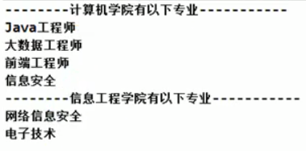
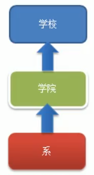

# 统一遍历问题
 

 编写程序展示一个学校院系结构:需求是这样的,要在一个页面中展示出学校的院系组成,一个学校有多个学院,一个学院有多个系
 
 

前面的[组合模式](./77_组合模式_院校展示.md)也用到了这个案例,这里要认真看,体会一下区别

## 传统的设计方案(类图)

 
 
 
 ## 传统模式id问题分析
 
> 我现在比如我的计算机学院的系的信息是存在一个数组中的,
 但是我这个信息工程学院的信息是存储在集合中了
>
>
>然后就涉及到一个遍历的问题,我们怎么能够把他们统一的遍历出来
>
>这个时候就需要我们这个迭代器模式了
 
 1. 将学院看做是学校子类,系是学院的子类,这样实际上是站在组织大小来进行分层次的
 2. **实际上我们的要求是**: 在一个页面中展示出学校的院系组成,一个学校有多个学院,一个学院有多个系,因此这种方案,不能很好的实现**遍历**的操作.
 3. 解决方案: => **迭代器模式**

 
 
 
 
 
 
 
# 迭代器 VS 组合模式

迭代器注重的是遍历,组合模式注重各个组成部分 
 
 
 
 
 
 
 
 
 
 
 
 

 
 
 
 
 
 
 
 
 
 
 
 
 
 
 
 
 
 
 
 
 
 
 
 
 
 
 
 
 
 
 
 
 
 
  