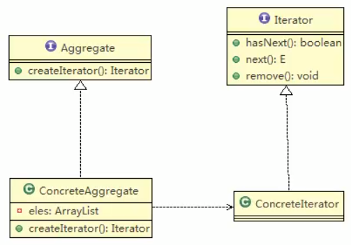
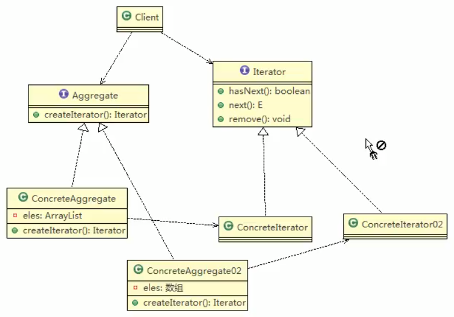
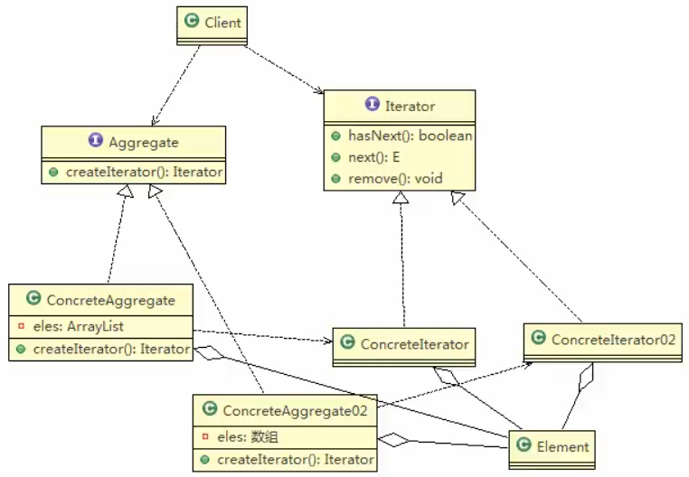

# 迭代器模式概念

1. 迭代器模式(Iterator pattern)是常用的设计模式,属于行为型模式
2. 如果我们的集合元素是用不同的方式实现的,有数组,还有Java的集合类或者还有其他方式,当客户端要**遍历这些集合元素**的时候,就要使用多种遍历方式,而且还会暴漏元素的内部结构,可以考虑使用迭代器模式解决.
3. 迭代器模式,提供一种遍历集合元素的统一接口,用一致的方法遍历集合元素,不需要知道集合对象的底层表示,即: 不暴露其内部的结构.
 
 
 
 
 # 类图
 ## 一个数组类型
 
 ## 扩展另一类型
 
 
 # 类图解析
 对原理图的说明
 1. Iterator: 迭代器接口,是系统提供,含义hasNext,next,remove
 2. ConcreteIterator: 具体的迭代器类,管理迭代
 3. Aggregate: 一个统一的聚合接口,将客户
 4. ConcreteAggregate: 具体的聚合持有对象集合,并提供一个方法,返回一个迭代器,该迭代器可以正确遍历集合
 5. Client:客户端,他通过`Iterator`和`Aggregate`依赖子类
 ## 在严谨一点
 
 应该有一个`Element`
 
 ### 新的类图
  

 >懵逼中...
 
 
 
 
 
 
 
 
 
 
 
 
 
 
 
 
 
 
 
 
 
 
 
 

 
 
 
 
 
 
 
 
 
 
  