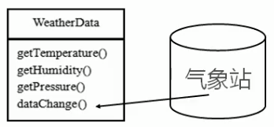
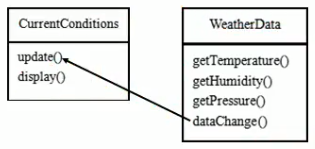

# 案例分析
## 天气预报项目需求
1. 气象站可以将每天测量到的温度,湿度,气压 等等以公告的形式发布出去(比如发布到自己的网站或第三方)
2. 需要设计开放型API,便于其他第三方也能够接入气象站获取数据
3. 提供温度,气压和湿度的接口
4. 测量数据更新时,要能实时的通知给第三方


## 普通方案
WeatherData类
### 获取方式
通过对气象站项目的分析,我们可以初步设计出一个WeatherData类



说明: 
1. 通过getxxx方法,可以让第三方接入,并得到相关信息
2. 当数据有更新时,气象站通过调用dataChange()去更新数据,当第三方再次获取时,就能得到最新数据,当然也可以**推送**

>气象站的网站他每隔一段时间就调用WeatherData里面的获取数据
>
>
 ### 推送方式

 


CurrentConditions(当前的天气情况)

可以理解成是我们气象局的网站 //**推送**

## 代码演示

### CurrentConditions


```java
package com.atguigu.observer;

/**
 * 显示当前天气情况(可以理解成是气象站自己的网站)
 * @author victor
 */
public class CurrentConditions {
    // 温度
    private float temperature;
    // 气压
    private float pressure;
    // 湿度
    private float humidity;

    // 更新天气情况 ,别人来调用,是由于WeatherData来调用,我使用退送模式
    public void update(float temperature, float pressure, float humidity) {
        this.temperature = temperature;
        this.pressure = pressure;
        this.humidity = humidity;
        display();
    }

    // 显示
    public void display() {
        System.out.println("---Today mTemperature"+temperature+"---");
        System.out.println("---Today mPressure"+pressure+"---");
        System.out.println("---Today mhumidity"+humidity+"---");
    }

}
```


 

### WeatherData


```javapackage com.atguigu.observer;

/**
 * 类是核心
 * 1. 包含最新的天气情况信息
 * 2. 含有CurrentConditions对象
 * 3. 当数据有更新时,就主动的调用CurrentCondition对象的Update()方法
 *    这个方法里面含有一个display的操作,这样他们接入方就看到了最新的信息
 * @project java_mode
 * @package com.atguigu.observer
 */
public class WeatherData {
    private float temperature;      // 温度
    private float pressure;         // 气压
    private float humidity;         // 湿度
    private CurrentConditions currentConditions;

    public WeatherData(CurrentConditions currentConditions) {
        this.currentConditions = currentConditions;
    }

    public void dataChange() {
        // 调用我们聚合的currentConditions中的update()方法
        currentConditions.update(getTemperature(),getPressure(),getHumidity());
    }

    // 当数据由于更新的时候,就调用setData
    public void setData(float temperature, float pressure, float humidity, CurrentConditions currentConditions) {
        this.temperature = temperature;
        this.pressure = pressure;
        this.humidity = humidity;
        // 调用dataChange,将最新的信息推送给接入方 currentCondition
        dataChange();
    }

    public float getTemperature() {
        return temperature;
    }

    public void setTemperature(float temperature) {
        this.temperature = temperature;
    }

    public float getPressure() {
        return pressure;
    }

    public void setPressure(float pressure) {
        this.pressure = pressure;
    }

    public float getHumidity() {
        return humidity;
    }

    public void setHumidity(float humidity) {
        this.humidity = humidity;
    }

    public CurrentConditions getCurrentConditions() {
        return currentConditions;
    }

    public void setCurrentConditions(CurrentConditions currentConditions) {
        this.currentConditions = currentConditions;
    }
}
```


 ### 客户端
 #### 设置天气
 ```java
package com.atguigu.observer;

/**
 * ClassName:  <br/>
 * Description:  <br/>
 * Date: 2021-02-09 9:43 <br/>
 * @project java_mode
 * @package com.atguigu.observer
 */
public class Client {
    public static void main(String[] args) {
        System.out.println("----观察者模式----");
        //        创建一个接入方
        CurrentConditions currentConditions = new CurrentConditions();
        // 创建 weatherData对象 ,并将接入方currentConditions 传递到WeatherData中
        WeatherData weatherData = new WeatherData(currentConditions);
        // 更新天气信息
        weatherData.setData(30,150,40);
        /**
         * ----观察者模式----
         * ---Today mTemperature30.0---
         * ---Today mPressure150.0---
         * ---Today mhumidity40.0---
         *
         * Process finished with exit code 0
         */
    }
}

 ```
  #### 更新天气

 
  
 ```java
package com.atguigu.observer;

/**
 * ClassName:  <br/>
 * Description:  <br/>
 * Date: 2021-02-09 9:43 <br/>
 * @project java_mode
 * @package com.atguigu.observer
 */
public class Client {
    public static void main(String[] args) {
        System.out.println("----观察者模式----");
        //        创建一个接入方
        CurrentConditions currentConditions = new CurrentConditions();
        // 创建 weatherData对象 ,并将接入方currentConditions 传递到WeatherData中
        WeatherData weatherData = new WeatherData(currentConditions);
        // 更新天气信息
        weatherData.setData(30,150,40);
        // 天气情况变化
        System.out.println("----天气情况变----");
        weatherData.setData(40, 160, 20);
        /**
         *----观察者模式----
         * ---Today mTemperature30.0---
         * ---Today mPressure150.0---
         * ---Today mhumidity40.0---
         * ----天气情况变----
         * ---Today mTemperature40.0---
         * ---Today mPressure160.0---
         * ---Today mhumidity20.0---
         *
         * Process finished with exit code 0
         */
    }
}
 ```
 
 
 ## 问题分析
 
 1. 其他第三方接入气象站获取数据的问题
 2. 无法在运行时动态的添加第三方(比如新浪网站)
 3. 违反了OCP原则 => 观察者模式
>那就要在创建一个类似CurrentConditions.java的类为新浪
>
>然后在WeatherData加入新的第三方
>
>不符合我们的OCP原则
>

// 在WeatherData中,当增加一个第三方,都需要创建一个对应的第三方的公告板对象,并加入到dataChange,不利于维护,也不是动态加入
```java
public void dataChange(){
    currentConditions.update(getTemperature(),getPressure(),getHumidity())
}
```
 

