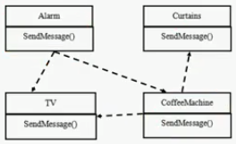
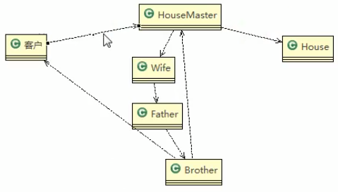
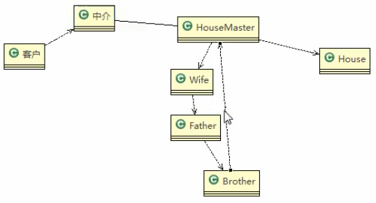
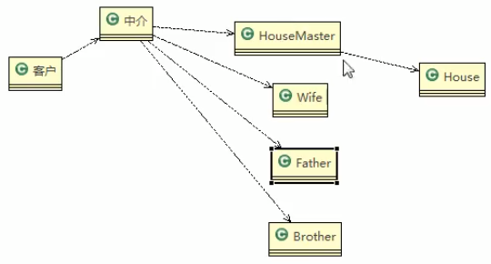

# 智能家庭管理问题

## 智能家庭项目:
1. 智能家庭包括各种设备,闹钟,咖啡机,电视机,窗帘 等
2. 主任要看电视时,各个设备可以协同工作,自动完成看电视的准备工作,比如流程为: 

>闹铃响起 => 咖啡机开始做咖啡 => 窗帘自动落下 => 电视机开始播放
## 传统方案

## 类图(租房子)
### 问题

> 比如你要租房,你本来和Master弹好了
>
>房主HouseMaster说不行,我得问一下我的Wife,
>
>wife说不行,我要问一下我的Father,
>
>Father说不行我得问一下我的Brother
>
>然后还要一层一层的返回
>
>

这样呢,这个流程就很麻烦,现在怎么改进呢

### 改进

>这样,在他们之间有一个中介来维护
>
>换而言之,他们直接也不要有关系了,这回
>
>这样可以不让系统之间进行交流

> 你这样,不要让子系统相互调用,否则就会相当的麻烦了
>
>终结者模式利用他比较特殊的身份,减少子系统之间的耦合
>

## 传统的方式的问题分析

1. 当各电器对象有多种状态改变的时候,相互之间的调用关系会比较复杂
2. 各个电器对象彼此联系,**你中有我,我中有你,不利于松耦合**
3. 各个电器之间所传递的消息(参数),容易混乱
4. 当系统增加一个新的电器对象时候,或者执行流程改变时,代码的可维护性,扩展性,都不理想 => 考虑**终结者模式**

 
 
 
 
 
 
  
