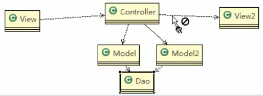
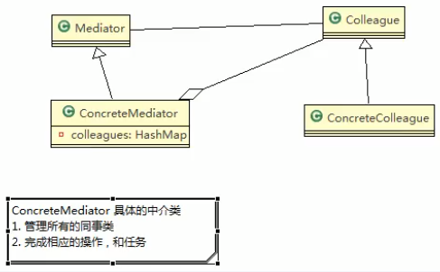
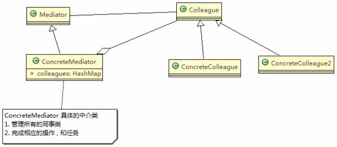
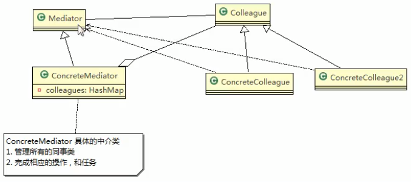
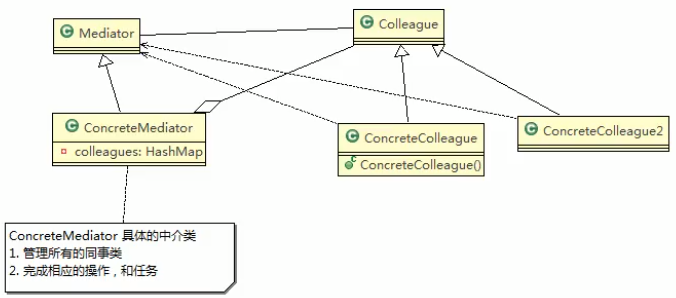
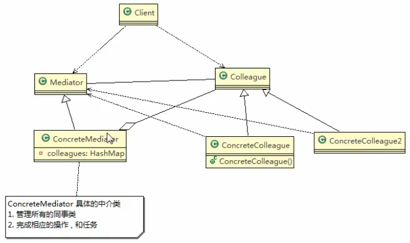

# 终结者模式基本介绍

1. 终结者模式(Mediator Pattern),用一个终结者对象来封装一系列的对象交互.
    终结者是各个对象不需要显示地相互引用,从而使其耦合松散,而且可以独立地改变他们之间的交互
2. 终结者模式属于行为型模式,使代码易于维护
3. 比如MVC模式,C(Controller控制器)是M(Model模型)和V(View视图)的终结者,在前后端交互时起到了中间人的作用.
## MVC原理类图
 

>Controller就是终结者
>

## 终结者原理图

>ConcreteColleague还可能有第二个
>

> ConcreteColleague 是怎么把自己的实例放入到这个HashMap里面去的呢
>
> 终结者模式采取了一个巧妙的方法
>
>他在创建自己的时候,创建一个具体的同事类的时候,就把自己放在了ConcreteMediator的集合里面去了
>
>他会用到这个Mediator
>
>

>`ConcreteColleague`在构造器中,在构造自己的时候,它会把这个`Mediator`拿到
>
>通过`Mediator`调用他的相关的方法,就把他放在了这个具体的中介类的`HashMap`里面去了

 
 
 >客户端调用
>
>
 
 
 
 ## 对于原理类图的说明
 
 1. Mediator就是抽象终结者,定义了同事对象到终结者对象的接口
 2. Colleague 是抽象同事类(后面我们去管理的子系统的父类,比如电器,具体的人)
 3. ConcreteMediator 具体的终结者对象,实现抽象方法,他需要知道所有的具体的同事类,即他会以一个集合来管理`HashMap`,并接受某个同事对象消息,完成相应的任务
 4. ConcreteColleague 具体的同事类,会有很多,每个同事只知道自己的行为,而不了解其他同事类的情况行为(方法),但是它们都含有(依赖)**终结者对象**.
 
 
> 精髓: ConcreteColleague和ConcreteColleague2 之间么有关系,实现解耦
>
>
 
 
 
 
 
 
 
 
  