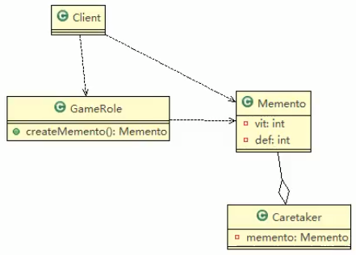

# 游戏角色恢复状态实例

## 1. 应用实例要求
游戏角色有攻击力和防御力,在大战Boss前身保存自身的状态(攻击力和防御力),当大战Boss后攻击力和防御力下降,从备忘录对象恢复到大战前的状态

## 2. 思路分析和图解(类图)


>

## 3. 代码实现

### Memento

```java
package com.atguigu.memento.game;

/**
 * ClassName:  <br/>
 * Description:  <br/>
 * Date: 2021-02-09 15:16 <br/>
 * @project java_mode
 * @package com.atguigu.memento.game
 */
public class Memento {
    //攻击力
    private int vit;
    //防御力
    private int def;

    public Memento(int vit, int def) {
        this.vit = vit;
        this.def = def;
    }

    public int getVit() {
        return vit;
    }

    public void setVit(int vit) {
        this.vit = vit;
    }

    public int getDef() {
        return def;
    }

    public void setDef(int def) {
        this.def = def;
    }
}

```


 
 
 
 
### Caretaker

```java
package com.atguigu.memento.game;

import java.util.ArrayList;
import java.util.HashMap;

/**
 * ClassName:守护者对象,保存游戏角色的状态
 * @project java_mode
 * @package com.atguigu.memento.game
 */

public class Caretaker {
    // 如果只保存一次状态
    private Memento memento;
//    // 对GameRole保存多次状态
//    private ArrayList<Memento> mementos;
//    // 对多个游戏角色保存多个状态
//    private HashMap<String ,ArrayList<Memento>> rolesMementos;

    public Memento getMemento() {
        return memento;
    }

    public void setMemento(Memento memento) {
        this.memento = memento;
    }
}

```

### GameRole

```java
package com.atguigu.memento.game;

/**
 * ClassName:  <br/>
 * Description:  <br/>
 * Date: 2021-02-09 15:20 <br/>
 * @project java_mode
 * @package com.atguigu.memento.game
 */
public class GameRole {
    private int vit;
    private int def;
    //  创建一个Memento 通你这个游戏角色 当前的状态得到一个
    public Memento createMemento() {
        return new Memento(vit, def);
    }

    // 从备忘录对象,恢复GameRole'状态
    public void recoverGameRoleFromMemento(Memento memento) {
        this.vit = memento.getVit();
        this.def = memento.getDef();
    }

    // 显示当前游戏角色的状态
    public void display() {
        System.out.println("游戏角色当前的攻击力:"+this.vit);
        System.out.println("游戏角色当前的防御力:"+this.def);
    }

    public int getVit() {
        return vit;
    }

    public void setVit(int vit) {
        this.vit = vit;
    }

    public int getDef() {
        return def;
    }

    public void setDef(int def) {
        this.def = def;
    }
}

```


 
 ### 客户端
 
 ```java
package com.atguigu.memento.game;

/**
 * ClassName:  <br/>
 * Description:  <br/>
 * Date: 2021-02-09 15:25 <br/>
 * @project java_mode
 * @package com.atguigu.memento.game
 */
public class Client {
    public static void main(String[] args) {
        System.out.println("----备忘录模式--------");
        // 创建游戏角色
        GameRole gameRole = new GameRole();
        gameRole.setVit(100);
        gameRole.setDef(100);
        System.out.println("----和boss大战之前的状态----");
        gameRole.display();
        // 把当前的状态保存caretaker
        Caretaker caretaker = new Caretaker();
        caretaker.setMemento(gameRole.createMemento());
        //
        System.out.println("和boss开始大战~~~");
        gameRole.setVit(30);
        gameRole.setDef(30);
        System.out.println("大战之后~~~");
        gameRole.display();

        System.out.println("大战只后,使用备忘录对象恢复到大战之前");
        gameRole.recoverGameRoleFromMemento(caretaker.getMemento());
        System.out.println("恢复后的状态:");
        gameRole.display();
        /**
         * ----备忘录模式--------
         * ----和boss大战之前的状态----
         * 游戏角色当前的攻击力:100
         * 游戏角色当前的防御力:100
         * 和boss开始大战~~~
         * 大战之后~~~
         * 游戏角色当前的攻击力:30
         * 游戏角色当前的防御力:30
         * 大战只后,使用备忘录对象恢复到大战之前
         * 恢复后的状态:
         * 游戏角色当前的攻击力:100
         * 游戏角色当前的防御力:100
         *
         * Process finished with exit code 0
         */
    }
}
```

 
 
 

 
