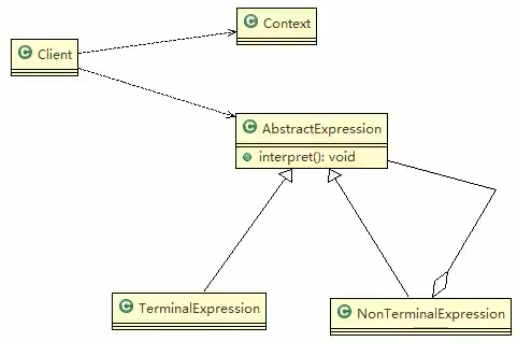

# 解释器模式基本介绍

1. 在编译原理中,一个算术表达式通过**词法分析器**形成词法单元,而后这些词法单元再通过**语法分析器**构建语法分析树,最终形成一颗抽象的语法分析树.这里的词法分析器和语法分析器都可以看做是解释器

2. 解释器模式(Interpreter pattern):是指给定一个语言表达式)定义它的文法的一种表示,并定义一个解释器,使用该解释器来解释语言中的句子(表达式)
3. 应用场景
- 应用可以将一个需要解释执行的语言中的句子表示为一个抽象语法树
- 一些重复出现的问题可以用一种简单的语言来表达
- 一个简单语法需要解释的场景
4. 这样的例子还有,比如编译器,运算表达式计算,正则表达式,机器人等

## 原理类图

 ## 对原理类图的说明
 
 解释器模式角色及职责
 
1. Context:是环境角色,含有解释器之外的全局信息
2. AbstractExpression: 抽象表达式,声明一个抽象的解释操作,这个方法为抽象语法树中所有的节点所共享
3. TerminalExpression: 为终结符表达式,实现与文法中的终结符相关的解释操作
4. NonTerminalExpression: 为非终结符表达式,实现与文法中的非终结符实现解释操作.
5. 说明: 输入Context 和 TerminalExpression 信息通过Client输入即可.

> 我疯了
>

 
 
 
 
 
 
 
 
 
 
 
 
 
 
 
 
 
 
 
 
 
 
 
 
 
 

 
 
 
 
 
  
 
 