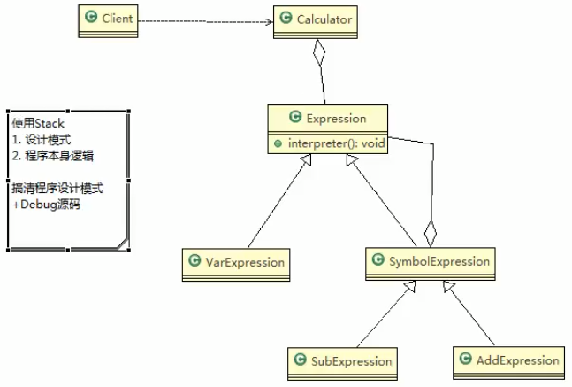

# 计算求值

## 原理类图


## 代码实践

### Expression

```java
package com.atguigu.interpreter;


import java.util.HashMap;

/**
 * 抽象类表达式,通过HashMap键值对,可以获取到变量的值
 *
 * @author victor
 */
public abstract class Expression {
    // a+b-c
    // 解释公式和数值,key就是公式(表达式),参数[a,b,c],value就是具体值
    // HashMap {a=10,b=20}
    public abstract int interpreter(HashMap<String, Integer> var);
}

```
 
 
 
 
 ### SymbolExpression
 
 ```java
package com.atguigu.interpreter;

import java.util.HashMap;

/**
 * ClassName:  <br/>
 * Description:  抽象 的运算符号解析器,这里每个运算符号,都只和自左右两个数字有关系,但左右两个数字有可能也是一个解析的结果,无论何种类型,都是Expression类的实现类
 * @project java_mode
 * @package com.atguigu.interpreter
 */
public class SymbolExpression extends Expression{
    protected Expression left;
    protected Expression right;

    public SymbolExpression(Expression left, Expression right) {
        this.left = left;
        this.right = right;
    }

    /**
     * 因为SymbolExpression是让其子类来实现,
     * 因此interpreter是一个默认实现
     * @param var
     * @return
     */
    @Override
    public int interpreter(HashMap<String, Integer> var) {
        return 0;
    }
}

```
 
 
 ### VarExpression
 
 ```java
package com.atguigu.interpreter;

import java.util.HashMap;

/**
 * 变量的解释器
 * @author victor
 */
public class VarExpression extends Expression{
    private String key;

    public VarExpression(String key) {
        this.key = key;
    }

    // var就是{a=10,b=20}
    // interpreter 根据变量的名称,返回对应的值
    @Override
    public int interpreter(HashMap<String, Integer> var) {
        return var.get(this.key);
    }
}

```
 
 
 
 
 
 
 
 
 
 
 
 
 
 
 
 
 ### AddExpression
 
 ```java
package com.atguigu.interpreter;

import java.util.HashMap;

/**
 * ClassName:  <br/>
 * Description:  加法解释器
 * @project java_mode
 * @package com.atguigu.interpreter
 */
public class AddExpression extends SymbolExpression{

    public AddExpression(Expression left, Expression right) {
        super(left, right);
    }
    // 处理相加
    // var仍然是{a=10,b=20}...
    @Override
    public int interpreter(HashMap<String, Integer> var) {
        // super.left.interpreter(var): 返回左边表达式对应的值
        // super.right.interpreter(var):返回右边表达式对应的值
        return super.left.interpreter(var)+super.right.interpreter(var);
        // 你不要纠结他是怎么程序中怎么算出来的
        // 体会设计模式,这个程序本身复杂,但是光看设计模式不复杂
    }
}

```
 
 
 
 
 
 
 
 
 
 
 
 
 
 
 
 
 
 
 
 
 ### SubExpression
 
 ```java
package com.atguigu.interpreter;

import java.util.HashMap;

/**
 * ClassName:  <br/>
 * Description:
 * @project java_mode
 * @package com.atguigu.interpreter
 */
public class SubExpression extends SymbolExpression{
    public SubExpression(Expression left, Expression right) {
        super(left, right);
    }

    /**
     * 求出left和right表达式相减后的结果
     * @param var
     * @return
     */
    @Override
    public int interpreter(HashMap<String, Integer> var) {
        return super.left.interpreter(var)-super.right.interpreter(var);
    }
}

```
 
 
 
 
 
 
 
 
 
 
 
 
 
 
 
 ### Calculator
 
 ```java
package com.atguigu.interpreter;

import java.util.HashMap;
import java.util.Stack;

/**
 * ClassName:  <br/>
 * Description:  <br/>
 * @project java_mode
 * @package com.atguigu.interpreter
 */
public class Calculator {
    // 定义表达式
    private Expression expression;

    // 构造函数传参,并解析

    public Calculator(String expStr) {  // expStr = a+b
        // 安排运算先后顺序
        Stack<Expression> stack = new Stack<>();
        // 表达式拆分成字符数组
        char[] charArray = expStr.toCharArray();

        Expression left = null;
        Expression right = null;
        // 遍历我么的字符数组,即遍历 [a,+,b]
        // 针对不同的情况做响应处理
        for (int i = 0; i < charArray.length; i++) {
            switch (charArray[i]) {
                case '+':
                    //比如发现是一个加号
                    // 从stack取出left(左表达式)
                    left = stack.pop();
                    // 取出右边的表达式
                    right = new VarExpression(String.valueOf(charArray[++i]));
                    // 根据得到的left和right 构建AddExpression对象加入stack
                    stack.push(new AddExpression(left, right));
                    break;
                case '-':
                    //比如发现是一个减号
                    left = stack.pop();
                    right = new VarExpression(String.valueOf(charArray[++i]));
                    stack.push(new SubExpression(left, right));
                    break;
                default:
                    // 如果是一个 Var 变量,就创建一个VarExpression对象
                    // ,并push压入到Stack中
                    stack.push(new VarExpression(String.valueOf(charArray[i])));
                    break;
            }
        }
        // 当遍历完整个 charArray数组后,就在栈中就得到了最后的Expression,
        // 这个是组合好的Expression
        this.expression = stack.pop();
    }

    public int run(HashMap<String, Integer> var) {
        // 最后将表达式 a+b 和var 绑定 {a=10,b=20}
        // 然后传递给Expression的interpreter进行解释执行
        return this.expression.interpreter(var);
    }
}

```
 
 
 
 
 
 
 
 ### Client
 
 ```java
package com.atguigu.interpreter;

import java.io.BufferedReader;
import java.io.IOException;
import java.io.InputStreamReader;
import java.util.HashMap;

/**
 * ClassName:  <br/>
 * Description:  <br/>
 * @project java_mode
 * @package com.atguigu.interpreter
 */
public class Client {
    public static void main(String[] args) throws IOException  {
        String expStr = getExpStr();    // a+b
        HashMap<String,Integer> var = getValue(expStr);
        Calculator calculator = new Calculator(expStr);
        System.out.println("运算结果"+expStr+"="+calculator.run(var));
    }

    /**
     * 获得表达式
     * @return
     * @throws IOException
     */
    public static String getExpStr() throws IOException {
        System.out.println("请输入表达式;:");
        return(new BufferedReader(new InputStreamReader(System.in))).readLine();
    }

    public static HashMap<String,Integer> getValue(String expStr) throws IOException {
        HashMap<String, Integer> map = new HashMap<>();
        for (char ch : expStr.toCharArray()) {
            if (ch != '+' && ch != '-') {
                // 这里看不到了
            }
        }
        // todo 这里有若干行代码省略了
        // todo 这里有若干行代码省略了
        // todo 这里有若干行代码省略了
        return map;
    }
}
```
 
 
 
 
 
 
 
 
 
 
 
 
 
 
 
 
 >他这种设计模式的把这个表达式分成了2中类型
>
>要结合业务逻辑

 >这个模式和语法和一些解析有关,这个模式用的不是那么那啥
>
>这个模式他比较容易扩展
 
 
 
 
  
 
 
 