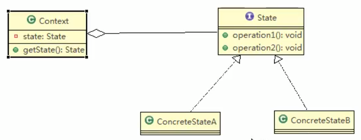

# App抽奖活动问题

请编写程序完成App抽奖活动 具体要求如下:
1. 加入每参加一次这个活动要扣除用户50积分,中奖概率是10%
2. 奖品数量固定,抽完就不能抽奖
3. 活动有4个状态,可以抽奖,不能抽奖,发放奖品和奖品领完
4. 活动的四个状态转换关系图如下:

 
 
 
 # 状态模式基本介绍
 
 1. 状态模式(State Pattern): 它主要用来解决对象在多种状态装换时,需要对外输出不同的行为的问题.状态和行为时一一对应的,状态之间可以相互转换
 2. 当一个对象的内在状态改变时,允许改变其行为,这个对象看起来像是改变了其类
 
 > 这个有点像verilog中的状态机
 
 ## 原理类图
 
 
 
  ### 对原理类图的说明-姐(状态模式的角色及其职责)
  1. Context类为环境角色,用于维护State实例,这个实例定义当前的状态
  2. State是抽象状态角色,定义一个接口封装与Context的一个特点相关行为
  3. ConcreteState具体的状态角色,每个子类实现一个与Context的一个状态相关行为.
 
 
 
 
 
 
 
 
 
 
 
 
 
 
 
 
 
 

 
 
 
  
 
 
 