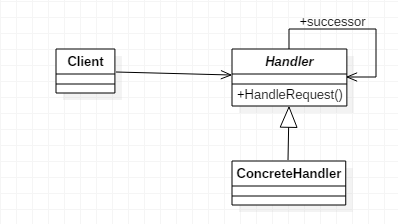
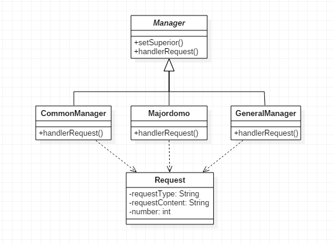
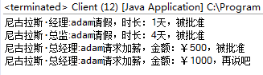

## 职责链模式的注意事项和细节
1. 将请求和处理分开,实现解耦,提高系统的灵活性
2. 简化了对象,使对象不需要知道链的结构
3. 性能会收到影响,特别是在链比较长的时间,因此需控制链中最大节点数量,一般通过Handler中设置一个最大节点数量,在setNext()方法中判断是否已经超过阈值,超过则不允许该链建立,避免出现超长链无意识地破坏系统性能.

## 一、什么是职责链模式

　　从文字角度出发，我们可以先将关注点放在“链”字上，很容易联想到链式结构，举个生活中常见的例子，击鼓传花游戏就是一个很典型的链式结构，所有人形成一条链，相互传递。而从另一个角度说，职责链就是所谓的多级结构，比如去医院开具病假条，普通医生只能开一天的证明，如果需要更多时常，则需将开具职责转交到上级去，上级医师只能开三天证明，如需更多时常，则需将职责转交到他的上级，以此类推，这就是一个职责链模式的典型应用。再比如公司请假，根据请假时常的不同，需要递交到的级别也不同，这种层级递进的关系就是一种多级结构。

　　**职责链模式（Chain Of Responsibility）**，使多个对象都有机会处理请求，从而避免请求的发送者和接收者之间的耦合关系。将这个对象连成一条链，并沿着这条链传递该请求，直到有一个对象处理它为止。UML结构图如下：



　　其中，Handler是抽象处理者，定义了一个处理请求的接口；ConcreteHandler是具体处理者，处理它所负责的请求，可访问它的后继者，如果可处理该请求就处理，否则就将该请求转发给它的后继者。

### 　　1. 抽象处理者

　　抽象处理者实现了三个职责：

- 定义一个请求的处理方法handlerMessage()，是唯一对外开放的方法
- 定义一个链的编排方式setNext()，用于设置下一个处理者
- 定义了具体的请求者必须实现的两个方法，即定义自己能够处理的级别的getHandlerLevel()方法及具体的处理任务echo()方法


```
 1 public abstract class Handler {
 2     
 3     private Handler nextHandler;    //下一个处理者
 4     
 5     public final Response handlerMessage(Request request) {
 6         Response response = null;
 7         
 8         if(this.getHandlerLevel().equals(request.getRequestLevel())) {    //判断是否是自己的处理级别
 9             response = this.echo(request);
10         } else {
11             if(this.nextHandler != null) {    //下一处理者不为空
12                 response = this.nextHandler.handlerMessage(request);
13             } else {
14                 //没有适当的处理者，业务自行处理
15             }
16         }
17         
18         return response;
19     }
20     
21     //设定下一个处理者
22     public void setNext(Handler handler) {
23         this.nextHandler = handler;
24     }
25     
26     //每个处理者的处理等级
27     protected abstract Level getHandlerLevel();
28     
29     //每个处理者都必须实现的处理任务
30     protected abstract Response echo(Request request);
31 
32 }
```


### 　　2. 具体处理者

　　这里我们定义三个具体处理者，以便能组成一条链，ConcreteHandlerB及ConcreteHandlerC就不再赘述了。


```
 1 public class ConcreteHandlerA extends Handler {
 2 
 3     @Override
 4     protected Level getHandlerLevel() {
 5         //设置自己的处理级别
 6         return null;
 7     }
 8 
 9     @Override
10     protected Response echo(Request request) {
11         //完成处理逻辑
12         return null;
13     }
14 
15 }
```


### 　　3. Level类

　　Level类负责定义请求和处理级别，具体内容需根据业务产生。

```
1 public class Level {
2     //定义一个请求和处理等级
3 }
```

### 　　4. Request类

　　Request类负责封装请求，具体内容需根据业务产生。


```
1 public class Request {
2     
3     //请求的等级
4     public Level getRequestLevel() {
5         return null;
6     }
7     
8 }
```


### 　　5. Response类

　　Response类负责封装链中返回的结果，具体内容需根据业务产生。

```
1 public class Response {
2     //处理者返回的数据
3 }
```

### 　　6. Client客户端

　　我们在场景类或高层模块中对类进行组装，并传递请求，返回结果。如下对三个具体处理者进行组装，按照1→2→3的顺序，并得出返回结果。


```
 1 public class Client {
 2     
 3     public static void main(String[] args) {
 4         Handler handler1 = new ConcreteHandlerA();
 5         Handler handler2 = new ConcreteHandlerB();
 6         Handler handler3 = new ConcreteHandlerC();
 7         
 8         //设置链中的阶段顺序 1->2->3
 9         handler1.setNext(handler2);
10         handler2.setNext(handler3);
11         
12         //提交请求返回结果
13         Response response = handler1.handlerMessage(new Request());
14     }
15 
16 }
```


　　当然这是个未完成的模板，最终结果会因为 request.getRequestLevel() 为空而抛出异常，具体内容需根据业务逻辑进行编写。

##  二、职责链模式的应用

### 　　1. 何时使用

- 处理消息时

### 　　2. 方法

- 拦截的类都实现同一接口

### 　　3. 优点

- 将请求和处理分开，实现解耦，提高系统的灵活性
- 简化了对象，使对象不需要知道链的结构

### 　　4. 缺点

- 性能会收到影响，特别是在链比较长的时候
- 调试不方便。采用了类似递归的方式，调试时逻辑可能比较复杂
- 不能保证请求一定被接收

### 　　5. 使用场景

- 有多个对象可以处理同一个请求
- 在不明确指定接收者的情况下，向多个对象中的提交请求
- 可动态指定一组对象处理请求

### 　　6. 应用实例

- 多级请求
- 击鼓传花
- 请假/加薪请求
- Java Web中Tomcat对Encoding的处理、拦截器

### 　　7. 注意事项

- 需控制链中最大节点数量，一般通过在Handler中设置一个最大节点数量，在setNext()方法中判断是否已经超过阀值，超过则不允许该链建立，避免出现超长链无意识地破坏系统性能

## 三、职责链模式的实现

　　我们就以请假/加薪为例，实现一个较为简单的职责链模式。UML图如下：



### 　　1. 抽象管理者

　　通过Manager抽象类管理所有管理者，setSuperior()方法用于定义职责链的下一级，即定义当前管理者的上级。


```
 1 public abstract class Manager {
 2     
 3     protected String name;
 4     protected Manager superior;    //管理者的上级
 5     
 6     public Manager(String name) {
 7         this.name = name;
 8     }
 9     
10     //设置管理者的上级
11     public void setSuperior(Manager superior) {
12         this.superior = superior;
13     }
14     
15     //申请请求
16     public abstract void handlerRequest(Request request);
17 
18 }
```


### 　　2. 具体管理者

　　经理类如下，只可批准两天以内的假期，其余请求将继续申请上级。


```
 1 public class CommonManager extends Manager {
 2 
 3     public CommonManager(String name) {
 4         super(name);
 5     }
 6 
 7     @Override
 8     public void handlerRequest(Request request) {
 9         if (request.getRequestType().equals("请假") && request.getNumber() <= 2) {    //只能批准两天内的假期
10             System.out.println(name + ":" + request.getRequestContent() + "，时长：" + request.getNumber() + "天，被批准");
11         } else {    //其余请求申请上级
12             if (superior != null) {
13                 superior.handlerRequest(request);
14             }
15         }
16     }
17 
18 }
```


　　总监类如下，只可批准五天以内的假期，其余请求将继续申请上级。


```
 1 public class Majordomo extends Manager {
 2 
 3     public Majordomo(String name) {
 4         super(name);
 5     }
 6 
 7     @Override
 8     public void handlerRequest(Request request) {
 9         if (request.getRequestType().equals("请假") && request.getNumber() <= 5) {    //只能批准五天内的假期
10             System.out.println(name + ":" + request.getRequestContent() + "，时长：" + request.getNumber() + "天，被批准");
11         } else {    //其余请求申请上级
12             if (superior != null) {
13                 superior.handlerRequest(request);
14             }
15         }        
16     }
17 
18 }
```


　　总经理类，可以批准任意时常的假期，并且可以批准是否加薪。


```
 1 public class GeneralManager extends Manager {
 2 
 3     public GeneralManager(String name) {
 4         super(name);
 5     }
 6 
 7     @Override
 8     public void handlerRequest(Request request) {
 9         if (request.getRequestType().equals("请假")) {    //能批准任意时长的假期
10             System.out.println(name + ":" + request.getRequestContent() + "，时长：" + request.getNumber() + "天，被批准");
11         } else if (request.getRequestType().equals("加薪") && request.getNumber() <= 500) {
12             System.out.println(name + ":" + request.getRequestContent() + "，金额：￥" + request.getNumber() + "，被批准");
13         } else if (request.getRequestType().equals("加薪") && request.getNumber() > 500) {
14             System.out.println(name + ":" + request.getRequestContent() + "，金额：￥" + request.getNumber() + "，再说吧");
15         }
16     }
17 
18 }
```


### 　　3. 申请类


```
 1 public class Request {
 2     
 3     private String requestType;    //申请类别
 4     private String requestContent;    //申请内容
 5     private int number;    //数量
 6 
 7     public String getRequestType() {
 8         return requestType;
 9     }
10 
11     public void setRequestType(String requestType) {
12         this.requestType = requestType;
13     }
14 
15     public String getRequestContent() {
16         return requestContent;
17     }
18 
19     public void setRequestContent(String requestContent) {
20         this.requestContent = requestContent;
21     }
22 
23     public int getNumber() {
24         return number;
25     }
26 
27     public void setNumber(int number) {
28         this.number = number;
29     }
30     
31 }
```


###  　4. Client客户端

　　下面测试几组数据。


```
 1 public class Client {
 2     
 3     public static void main(String[] args) {
 4         CommonManager commonManager = new CommonManager("尼古拉斯·经理");
 5         Majordomo majordomo = new Majordomo("尼古拉斯·总监");
 6         GeneralManager generalManager = new GeneralManager("尼古拉斯·总经理");
 7         
 8         //设置上级
 9         commonManager.setSuperior(majordomo);
10         majordomo.setSuperior(generalManager);
11         
12         Request request = new Request();
13         request.setRequestType("请假");
14         request.setRequestContent("adam请假");
15         request.setNumber(1);
16         commonManager.handlerRequest(request);
17         
18         Request request2 = new Request();
19         request2.setRequestType("请假");
20         request2.setRequestContent("adam请假");
21         request2.setNumber(4);
22         commonManager.handlerRequest(request2);
23         
24         Request request3 = new Request();
25         request3.setRequestType("加薪");
26         request3.setRequestContent("adam请求加薪");
27         request3.setNumber(500);
28         commonManager.handlerRequest(request3);
29         
30         Request request4 = new Request();
31         request4.setRequestType("加薪");
32         request4.setRequestContent("adam请求加薪");
33         request4.setNumber(1000);
34         commonManager.handlerRequest(request4);
35     }
36 
37 }
```


 　运行结果如下：

　　

 

　　源码地址：https://gitee.com/adamjiangwh/GoF 
 
 
 
 
 
 
 

 
 
 
 
 
  
 