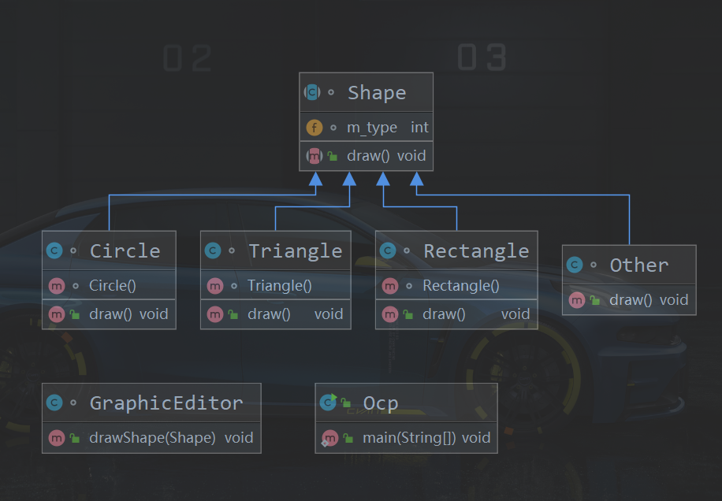
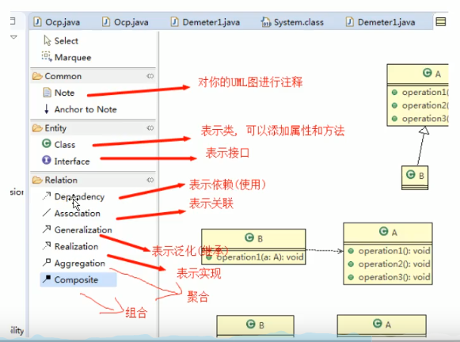

# UML
### 基本介绍

1. uml-unified modeling language UMl(统一建模语言),是一种用于软件系统分析和设计的语言工具,它用于帮助软件开发人员进行思考和记录思路的结果

2. UML本身是一套符号的规定,就像数学符号和化学符号一样,这些符号用于描述软件模型中的各个元素和他们之间的关系,比如类,接口,实现,泛化,依赖,组合,聚合,等

3. 使用UML来建模,常用的工具由于Rational Rose,也可以使用一些插件来建模

---

idea 实现的类图
 
 
 
 eclipse 中的 插件 
 
 
 
 
 [一个插件教程](https://plantuml.com/zh/class-diagram)
 
 ### UML图
 
 画UML图与写文章差不多,都是把自己的思想描述给别人看,关键在于思路和条理,UML图分类:
 
 1. 用例图(use case)
 2. 静态结构图: 类图,对象图,包图,组件图,部署图
 3. 动态行为图: 交互图(时序图与协作图),状态图,活动图
 
 说明:
 
 1. 类图是描述类与类之间的关系的,是UML图中最核心的
 
 2. 在讲解设计模式时,我们必然会使用类图,为了让学员们能够把设计模式学到位,需要先给大家讲解类图
 
 3. 温馨提示: 如果已经掌握UML类图的学员,可以直接听设计模式的章节
 

---

### 类图

1. 用于描述系统中的类(对象)本身的组成和类(对象)之间的各种静态关系.
2. 类之间的关系:依赖,泛化(继承),实现,关联,聚合与组合

3. 举例
 
 
 
 
 
 
 
 
 
 
 
 