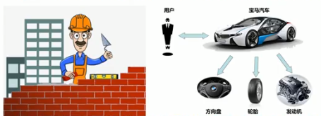
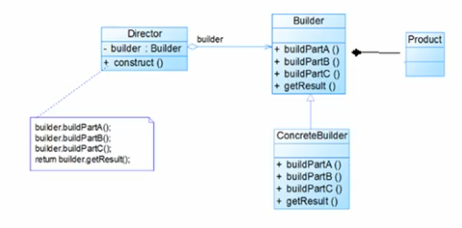
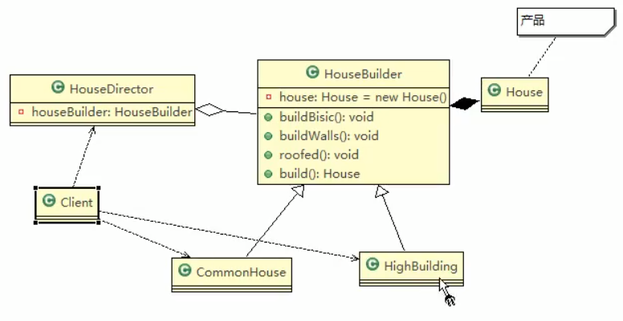

 
 
 # 建造者模式基本介绍
 
 ### 概念
 
 1. __建造者模式(Builder Pattern)__ 又叫生成器模式,是一种对象构建模式.
 它可以将复杂对象的构建过程抽象出来(抽象类别),使这个抽象过程的不同实现方法可以构造出不同表现(属性)的对象.
 
 2. __建造者模式__ 是一步一步创建一个复杂的对象,他允许用户只通过指定复杂对象的类型和内容就可以构建它们,用户不需要知道内部的具体构建细节.
 
 
 
 ---
 python 中的生成器? [菜鸟](https://www.runoob.com/python3/python3-iterator-generator.html)
 
 ---
 
 
 ### 建造者模式的4个角色
 
 1. Product(产品角色): 一个具体的产品对象
 2. Builder(抽象建造者): 创建一个Product对象的各个部件指定的接口
 3. ConcreteBuilder(具体建造者): 实现接口,构建和装配各个部件.
 4. Director(指挥者): 构建一个使用Builder接口的对象.它主要是用于创建一个复杂对象.他主要有2个作用,
 - 一是: 隔离了客户与对象的生产过程,
 - 二是: 负责控制产品对象的生产过程
 
 
 ### 建造者模式原理类图
 
 
 
 