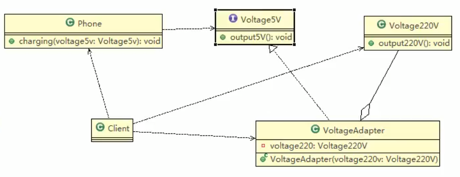

 
# 对象适配器模式
 
 
 ## 对象适配器模式介绍
 
 1. 基本思路和类的适配器模式相同,只是将Adapter类做修改,不是继承src类,而是持有src类的实例,以解决兼容性的问题. 即: 持有src类,实现dst接口,完成 src->dst的适配
 
 2. 根据 __"合成复用原则"__ ,在系统中尽量使用 __关联__ 关系来替代 __继承__ 关系.
 3. ___对象适配器模式是适配器模式常用的一种___
 
 
 ## 对象适配器模式应用实例
 
 1. 应用实例说明
 以生活中的充电器的例子来讲解适配器,充电器本身相当于Adapter,220V交流电相当于src(即被适配者),我们的目的地dst(即目标)是5V直直流电,使用 __对象适配器模式__ 完成
 2. 思路分析(类图): 只需要修改适配器即可,如下:
 
 
 
 ### 实践出真知
 在原来的基础上进行改动
 
 适配接口// 接口不用动
 
 
 ```java
package com.atguigu.adapter.objectadapter;

// 适配接口// 接口不用动
public interface IVoltage5V {
    public int output5V();
}
```


 被适配的类也不用动
 
 
 ```java
package com.atguigu.adapter.objectadapter;


// 被适配的类
public class Voltage220V {
    // 这个不用变
    public int output220V() {
        int src = 220;
        System.out.println("电压"+src+"福特");
        return src;
    }
}
```


VoltageAdapter适配器不在继承220V了,而是通过聚合的关系传递进来


```java
package com.atguigu.adapter.objectadapter;


public class VoltageAdapter implements IVoltage5V {

    // 我家一个属性
    private Voltage220V voltage220V;

    // 构造器
    public VoltageAdapter(Voltage220V voltage220V) {
        // 通过构造器,传入一个Voltage220V实例
        // 关联关系的聚合关系
        this.voltage220V = voltage220V;
    }

    @Override
    public int output5V() {
        //
        int dst = 0;
        if (null != voltage220V) {
            // 获取220V电压
            int src = voltage220V.output220V();
            //
            System.out.println("使用对象适配器记性转换,~");
            dst = src / 44;
            System.out.println("适配完成,输出的电压为="+dst);
        }
        return dst;
    }
}
```

执行

```java
package com.atguigu.adapter.objectadapter;


public class Client {

    public static void main(String[] args) {
         System.out.println("--对象适配器模式--");
        com.atguigu.adapter.objectadapter.Phone phone = new Phone();
        phone.charging(new VoltageAdapter(new Voltage220V()));
        /*
        --对象适配器模式--
        电压220福特
        使用对象适配器记性转换,~
        适配完成,输出的电压为=5
        电压为5V,可以充电~~~
        * */
    }
}

```

通过使用这个合成复用原则

来实现了由继承变成了聚合的关系

### 对象适配器模式注意事项和细节

1. 对象适配器和类适配器其实算是同一种思想,只不过实现的方式不同而已
   
   根据合成复用原则,使用组合替代继承,所以他解决了类适配器必须继承src的局限性问题,也不再要求dst必须是街口友.
2. 使用成本更低,更加的灵活

### 一句话
比如这个220V改了,改成了330V,你只需要改这个适配器,整个项目就能跑起来了又

优雅 的 coding~

"物是人非事事休，欲语泪先流"


     
