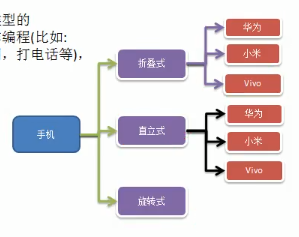
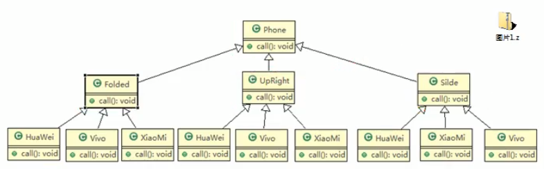
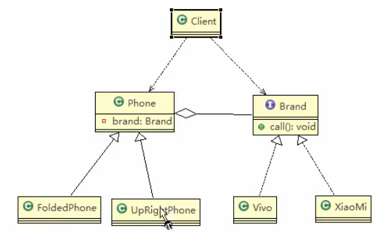

# 手机操作问题

现在对不同手机类型的不同品牌实现操作编程(比如: 开机,关机,上网,打电话等等)



传统方式类图





### 传统方案解决手机操作问题分析

1. 扩展性(问题),类爆炸,如果我们再增加手机的样式(旋转式),就需要增加各个品牌手机的类,同样如果我们增加一个手机品牌,也要在各个手机样式类下增加.
2. 违反了 __单一职责原则__ ,当我们增加手机样式时,要同时增加所有品牌的手机,这样增加了代码维护成本
3. 解决方案-使用桥接模式


### 类图





### 代码实践

```java
package com.atguigu.bridge;


public interface Brand {
    public void open();
    public void close();
    public void call();
}
```

```java
package com.atguigu.bridge;

public class Vivo implements Brand{
    @Override
    public void open() {
        System.out.println("vivo手机开机");
    }

    @Override
    public void close() {
        System.out.println("vivo shoyji关机");
    }

    @Override
    public void call() {
        System.out.println("vivo手机打电话!");
    }
}
```

```java
package com.atguigu.bridge;


public class XiaoMi implements Brand{
    @Override
    public void open() {
        System.out.println("小米手机开机");
    }

    @Override
    public void close() {
        System.out.println("xiaomi shoyji关机");
    }

    @Override
    public void call() {
        System.out.println("小米手机打电话!");
    }
}
```

```java
package com.atguigu.bridge;


public abstract class Phone {
    // 组合品牌
    private Brand brand;

    public Phone(Brand brand) {
        super();
        this.brand = brand;
    }

    protected void open() {
        this.brand.open();
    }
    protected void close() {
        this.brand.close();
    }
    protected void call() {
        this.brand.call();
    }
}
```


```java
package com.atguigu.bridge;

// 折叠是手机类,继承 抽象类Phone
public class FoldedPhone extends Phone{
    //  构造器
    public FoldedPhone(Brand brand) {
        // 初始化
        super(brand);
    }

    @Override
    protected void open() {
        super.open();
        System.out.println("打开折叠样式手机");
    }

    @Override
    protected void close() {
        super.close();
        System.out.println("关闭折叠样式手机");
    }

    @Override
    protected void call() {
        super.call();
        System.out.println("折叠样式手机打电话");
    }

}
```


```java
package com.atguigu.bridge;


public class Client {
    public static void main(String[] args) {
        // 获取折叠式手机(样式 + 品牌
        Phone phone1 = new FoldedPhone(new XiaoMi());
        phone1.open();
        phone1.call();
        phone1.close();

        System.out.println("-----------");
        Phone phone2 = new FoldedPhone(new Vivo());
        phone2.open();
        phone2.call();
        phone2.close();
        /*
        小米手机开机
        打开折叠样式手机
        小米手机打电话!
        折叠样式手机打电话
        xiaomi shoyji关机
        关闭折叠样式手机
        -----------
        vivo手机开机
        打开折叠样式手机
        vivo手机打电话!
        折叠样式手机打电话
        vivo shoyji关机
        关闭折叠样式手机

        Process finished with exit code 0

        * */
    }
}
```

### 扩展一个纸板的手机

```java
package com.atguigu.bridge;


public class UpRightPhone extends Phone{

    // 构造器
    public UpRightPhone(Brand brand) {
        super(brand);
    }

    @Override
    protected void open() {
        super.open();
        System.out.println("打开直板样式手机");
    }

    @Override
    protected void close() {
        super.close();
        System.out.println("关闭直板样式手机");
    }

    @Override
    protected void call() {
        super.call();
        System.out.println("直板样式手机打电话");
    }
}
```


```java
package com.atguigu.bridge;


public class Client {
    public static void main(String[] args) {
        // 获取折叠式手机(样式 + 品牌
        Phone phone1 = new FoldedPhone(new XiaoMi());
        phone1.open();
        phone1.call();
        phone1.close();

        System.out.println("-----------");
        Phone phone2 = new UpRightPhone(new Vivo());
        phone2.open();
        phone2.call();
        phone2.close();
        /*
        小米手机开机
        打开折叠样式手机
        小米手机打电话!
        折叠样式手机打电话
        xiaomi shoyji关机
        关闭折叠样式手机
        -----------
        vivo手机开机
        打开直板样式手机
        vivo手机打电话!
        直板样式手机打电话
        vivo shoyji关机
        关闭直板样式手机
        
        Process finished with exit code 0
        * */
    }
}

```


     
