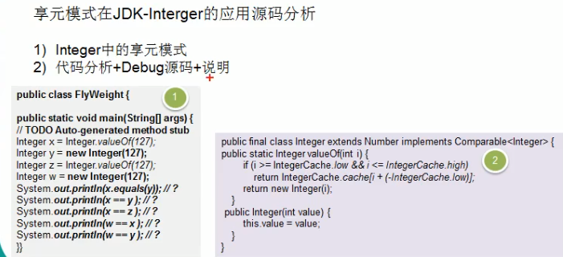

# 享元模式在



 
 
 ```java
package com.atguigu.jdk;


public class FlyWeight {
    public static void main(String[] args) {
        // TODO
        Integer x = Integer.valueOf(127);
        Integer y = new Integer(127);
        Integer z = Integer.valueOf(127);
        Integer w = new Integer(127);
        System.out.println(x.equals(y));    // true
        System.out.println(x == y); // false
        System.out.println(x == z); // true
        System.out.println(w == x); // false
        System.out.println(w == y); // false
    }
}

```
 
 
 ```java
    /**
     * Returns an {@code Integer} instance representing the specified
     * {@code int} value.  If a new {@code Integer} instance is not
     * required, this method should generally be used in preference to
     * the constructor {@link #Integer(int)}, as this method is likely
     * to yield significantly better space and time performance by
     * caching frequently requested values.
     *
     * This method will always cache values in the range -128 to 127,
     * inclusive, and may cache other values outside of this range.
     *
     * @param  i an {@code int} value.
     * @return an {@code Integer} instance representing {@code i}.
     * @since  1.5
     */
    public static Integer valueOf(int i) {
        if (i >= IntegerCache.low && i <= IntegerCache.high)
            // 这个范围是 刚好是 127 这里的范围和Python是保持一致的
            return IntegerCache.cache[i + (-IntegerCache.low)];
        return new Integer(i);
    }

```


 


 ```java
    /**
     * Cache to support the object identity semantics of autoboxing for values between
     * -128 and 127 (inclusive) as required by JLS.
     *
     * The cache is initialized on first usage.  The size of the cache
     * may be controlled by the {@code -XX:AutoBoxCacheMax=<size>} option.
     * During VM initialization, java.lang.Integer.IntegerCache.high property
     * may be set and saved in the private system properties in the
     * sun.misc.VM class.
     */

    private static class IntegerCache {
        static final int low = -128;
        static final int high;
        static final Integer cache[];

        static {
            // high value may be configured by property
            int h = 127;
            String integerCacheHighPropValue =
                sun.misc.VM.getSavedProperty("java.lang.Integer.IntegerCache.high");
            if (integerCacheHighPropValue != null) {
                try {
                    int i = parseInt(integerCacheHighPropValue);
                    i = Math.max(i, 127);
                    // Maximum array size is Integer.MAX_VALUE
                    h = Math.min(i, Integer.MAX_VALUE - (-low) -1);
                } catch( NumberFormatException nfe) {
                    // If the property cannot be parsed into an int, ignore it.
                }
            }
            high = h;

            cache = new Integer[(high - low) + 1];
            int j = low;
            for(int k = 0; k < cache.length; k++)
                cache[k] = new Integer(j++);

            // range [-128, 127] must be interned (JLS7 5.1.7)
            assert IntegerCache.high >= 127;
        }

        private IntegerCache() {}
    }
```
 
 
 > 这里面有点儿像内个 python中的 对象 内存优化 的通过(引用)定义
 
 
 ### 实践出真知
 
 
 
 ```java
package com.atguigu.jdk;


public class FlyWeight {
    public static void main(String[] args) {
        // TODO
        // 如果Integer.valueOf(x) x 在-127---128之间,就是使用享元模式返回
        // ,也就是说,要是有就返回,没有再创建

        Integer x = Integer.valueOf(127);
        Integer y = new Integer(127);
        Integer z = Integer.valueOf(127);
        Integer w = new Integer(127);
        System.out.println(x.equals(y));    // true
        System.out.println(x == y); // false
        System.out.println(x == z); // true
        System.out.println(w == x); // false
        System.out.println(w == y); // false

        Integer x1 = Integer.valueOf(200);
        Integer x2 = Integer.valueOf(200);
        System.out.println("x1==x2:"+(x1==x2));

        /*
        true
        false
        true
        false
        false
        x1==x2:false

        Process finished with exit code 0
        * */
    }
}
```
 
 ## 小结
 1. 在valueOf方法中,先判断值是否在IntegerCache 中, 如果不在,就创建新的Integer(new),
 否则,就直接从缓存池中返回
 2. valueOf方法 ,就使用到了 这个 **享元模式**.
 
 
 
 
 
 
 
 
 
 
 
 
 
 
 
 
 
 
 
 
 
 
 
 
 
 

