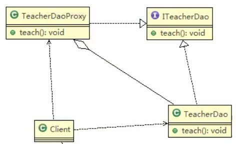

## 静态代理

静态代理在使用的时候,需要定义 接口或者父类,被代理对象(即目标对象)与代理对象一起实现相同的接口或者继承相同父类

## 应用实例

**具体要求**
1. 定义一个接口:ITeacherDao
2. 目标对象TeacherDao实现接口ITeactherDao
3. 使用静态 代理方式,就需要在代理对象TeacherDaoProxy中也实现ITeacherDao
4. 调用的时候通过调用代理对象的方法来调用目标对象.
5. 特别提醒: 代理对象与目标对象要实现相同的接口,然后通过调用相同的方法来调用目标对象的方法.


>代理对象要聚合被代理对象



 1. Client要创建TeacherDaoProxy代理对象
 2. 创建TeacherDao对象
 3. 将TeacherDao对象,交给TeacherDaoProxy对相,执行方法
 
 
 
 ## 代码实战
 
 
 ```java
package com.atguigu.proxy;

/**
 * 接口
 */
public interface ITeacherDao {
    // 授课方法
    void teach();
}

```
 
 
 ```java
package com.atguigu.proxy;


public class TeacherDao implements ITeacherDao {
    @Override
    public void teach() {
        System.out.println("老师正在授课中...");
    }
}

```
 
 
 ```java
package com.atguigu.proxy;

/**
 * 代理对象,静态代理
 */
public class TeeacherDaoProxy implements ITeacherDao {

    private ITeacherDao target;     // 目标对象,通过接口来依赖(聚合)/关联

    // 构造器
    public TeeacherDaoProxy(ITeacherDao target) {
        this.target = target;
    }

    @Override
    public void teach() {
        System.out.println("代理对象开始代里");
        target.teach();
        System.out.println("提交...");
        // 我怀疑这个是python中的装饰器
    }
}

```


客户端调用


```
package com.atguigu.proxy;


public class Client {
    public static void main(String[] args) {
        System.out.println("代理模式!");
        // 创建目标对象(被代理对象)
        TeacherDao teacherDao = new TeacherDao();
        // 创建代理对象,同时将被代理对象传递给代理对象
        TeeacherDaoProxy teeacherDaoProxy = new TeeacherDaoProxy(teacherDao);
        // 通过代理对象,调用到被代理对象的方法
        // 即: 执行的是代理对象的方法,代理对象再去调用目标对象的方法
        teeacherDaoProxy.teach();
        /*
        代理模式!
        代理对象开始代里
        老师正在授课中...
        提交...
        
        Process finished with exit code 0

        * */
    }
}
```
 
 
 
 ## 静态代理优缺点
 
 1. 有点:在不修改目标对象的功能前提下,能通过代理对象对目标功能扩展
 2. 缺点: 因为代理对象需要与目标对象实现一样的接口,所以会有很多代理类
 3. 一旦接口增加方法,目标对象与代理对象都要维护
 
 
 
 
 
 
 
 
 
 
 
 
 
 
 
 
 
 
 
 
 
 
 
 
 
 
 
 
 
 
 
 
 
 
 
 
 
 
 
 
 
 
 
 

