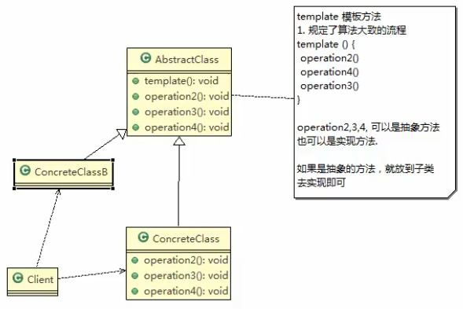

## 豆浆制作问题

编写制作豆浆的程序.说明如下.

1. 制作豆浆的流程

    选材 => 添加配料 => 浸泡 => 放到豆浆机打碎
2. 通过添加不同的配料,可以制作出不同口味的豆浆
3. 选材,浸泡和放到豆浆机打碎这几个步骤对于制作每种口味的豆浆都是一样的
4. 请使用 **模板方法模式i**完成 (说明: 以为模板方法模式,比较简单,很容易就想到这个方案),因此就直接使用,不再使用传统的方案来引出模板方法模式

> 音为模板方法比较简单,我们就不用传统方法来过渡了
>
>

    
## 模板方法模式基本介绍

1. 模板方法模式(Template Method Pattern),又叫模板模式(Template Pattern),在一个抽象类公开定义了执行它的方法的模板.它的子类可以按需要重写方法实现,但是调用将以抽象类中定义的方式进行.

2. 简单的说,模板方法模式 定义一个操作中的算法的骨架,而将一些步骤延迟到子类中,使得子类可以不改变一个算法结构,就可以重定义该算法的某些特定步骤

3. 这种类型的设计模式属于行为型模式.

> 说白了,又是套一层
>
>
 
 ## 原理类图
 
 
 
 
 说明
 
 1. `AbstractClass` 抽象类,类中实现了模板方法,定义了算法的骨架,具体子类需要去实现,其他抽象方法 `operation2,3,4`
 2. `ConcreteClass` 实现抽象方法`operation2,3,4` ,以完成算法中特定子类的相关步骤
 
 
 
 
 
 
 
 
 
 
 
 
 
 
 
 
 
 
 
 
 
 
 
 
 
 
 
 
 
 
 

 
 
 
 
 
 
 
 
 
 
 
 
 
 
 
 
 
 
 
 
 
 
 
 
 
  
 
 
 
 
 
 
 
 
 
 
 