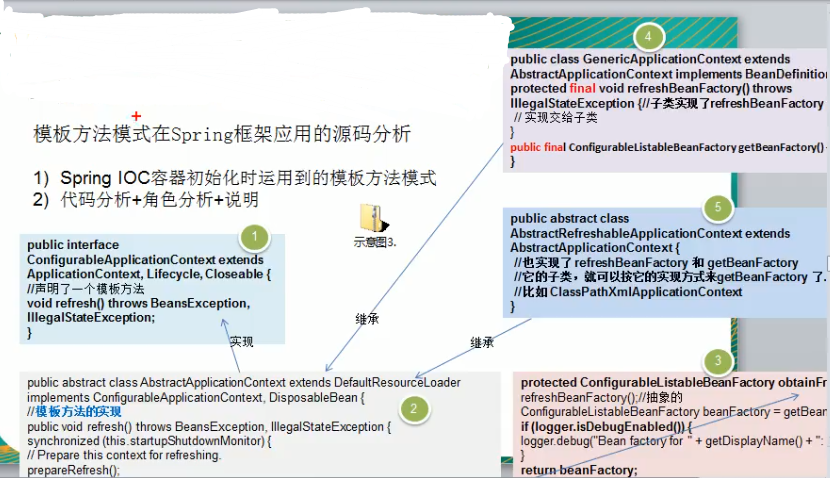
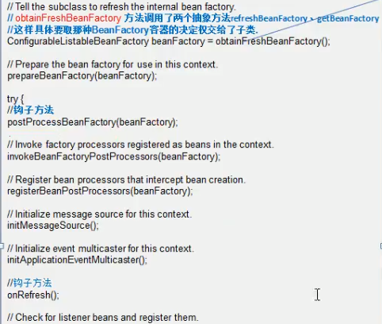
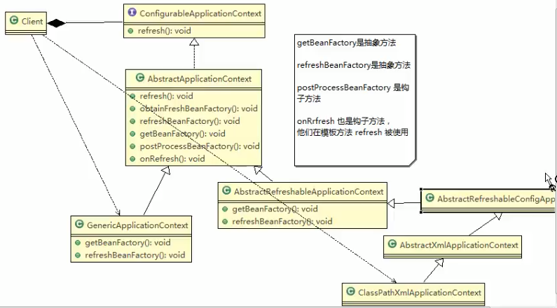

## IOC源码

 
 
 > 钩子方法, onRefresh
>
>如果父类做一个空实现,子类如果重写他,就按照子类的执行
>
>如果要是子类不重写,那就啥也不干,嗯
>
>让子类有一个灵活配置的机会
>
>
 
 
### 画一个类图

 
 

>
>
>设计模式只是一个考虑到思想的层面
>
>有可能他实现的类下面还是有子类
>
>而在这里我们可以不关心,嗯
>
>
 

 
 
 
 
 
 

